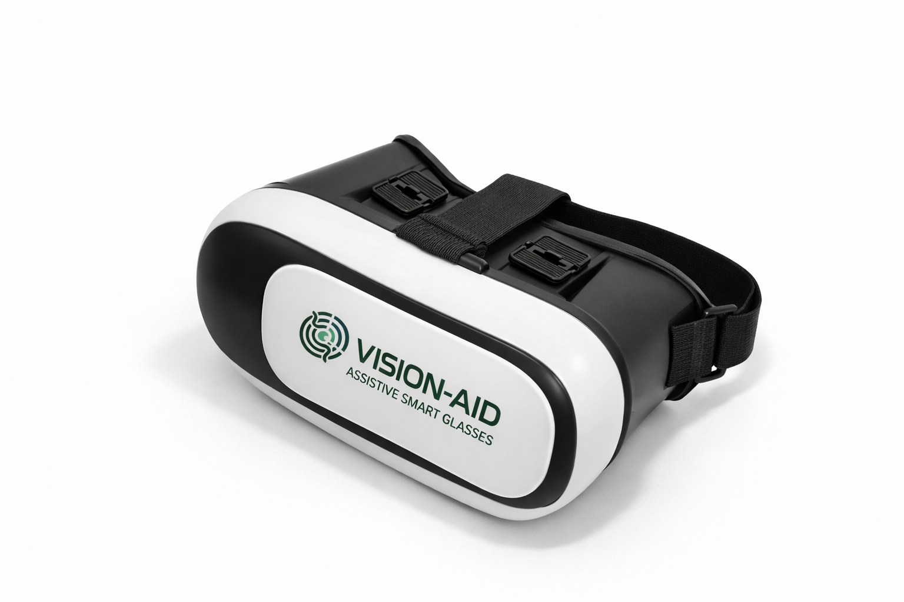
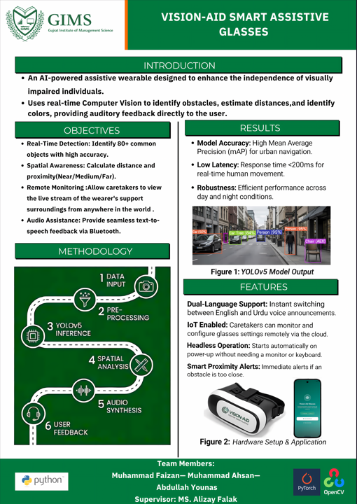

  
  <h1>Vision-Aid Smart Assistive System</h1>
  
<strong>An AI-powered wearable and mobile ecosystem designed to help visually impaired individuals navigate safely and independently.</strong>

---

## 📌 Project Overview
The **Vision-Aid System** is an end-to-end assistive technology solution combining **Edge Artificial Intelligence, IoT connectivity, and Mobile Application Engineering**. 

It consists of two main components:
1. **Edge AI Hardware (Raspberry Pi):** A wearable headset utilizing a Raspberry Pi 4, Picamera2, and VL53L0X Time-of-Flight (ToF) sensors. It runs **YOLOv5** locally for real-time object detection and provides auditory feedback via Bluetooth Text-to-Speech (TTS).
2. **Caretaker Mobile App (Flutter):** A cross-platform mobile application that connects to the headset via a **Tailscale Peer-to-Peer VPN**. It allows caretakers to monitor the user's camera POV globally, configure distance thresholds, and send real-time voice alerts using Speech-to-Text (STT) capabilities.

## 🏗️ Architecture & Technologies
This monorepo contains the full-stack implementation of the system.

### `raspberry_pi_backend/` (Edge AI & IoT)
*   **Hardware:** Raspberry Pi 4 Model B, Picamera2 (OV5647), VL53L0X (I2C ToF Sensor).
*   **Computer Vision:** YOLOv5s (PyTorch) running on CPU for local, low-latency object detection.
*   **Backend Server:** Python Flask server exposing a REST API and MJPEG stream.
*   **Networking:** Tailscale (Secure IoT Tunnel bypassing CGNAT).

### `flutter_app/` (Mobile Client)
*   **Framework:** Flutter (Dart) using Provider for State Management.
*   **Key Features:** 
    *   Dynamic Dark Mode Theme.
    *   Live MJPEG Video Stream viewing via Webview.
    *   Voice-to-Alert STT (Speech-to-Text) allowing caretakers to send audio warnings instantly.
    *   Local storage using Shared Preferences.

## 🚀 Features
*   **Real-Time Object Detection:** Identifies obstacles locally under 200ms without cloud latency.
*   **Global Remote Monitoring:** Caretakers can monitor the live feed from anywhere in the world securely via Tailscale.
*   **Precision Depth Sensing:** Utilizes ToF lasers for exact centimeter-level distance estimation.
*   **Hands-Free Communication:** Caretakers can speak into the app, and the text is relayed as audio into the user's Bluetooth earpiece.

## 📊 System Diagram

---
*Built as a Final Year Engineering Project (FYP) to bridge the gap in accessible, low-cost AI mobility aids.*
